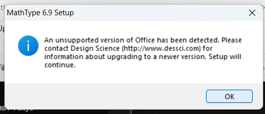

# 🌟 MathType Full Installation Guideline 🌟

### **MathType 6.9 Installer Download Link**: [📥 Download here](https://github.com/Shamimreza01/appsBackup/raw/refs/heads/main/MathType/MathType6.9.exe)

---

## 🚀 Step-by-Step Process to Install

### **1. Double-click the downloaded file.**

### **2. Follow the prompts:**
   - Select **I accept the terms in the license agreement**.
   - Click **Next**.  
   

### **3. Copy the License Key:** `MTWE691-011084-r0xyl`

   - Choose **Unlock MathType with a valid product key**.
     - Enter your **First Name** and **Last Name**.
     - Enter any name as an **Organization**.
     - **Paste your copied Product Key**.
     - Enter your **Email Address** (optional).
     - Check the box for **Please send my information...** (optional).
   

### **4. Finalize Installation:**
   - Mark **Install** and click **OK**.
   

### **5. Handling Installation Errors:**
   - If an error appears, click **OK** to proceed.
   

---

## 🎉 MathType was Successfully Installed!

### **6. Click Exit Setup to Finish.**
   
